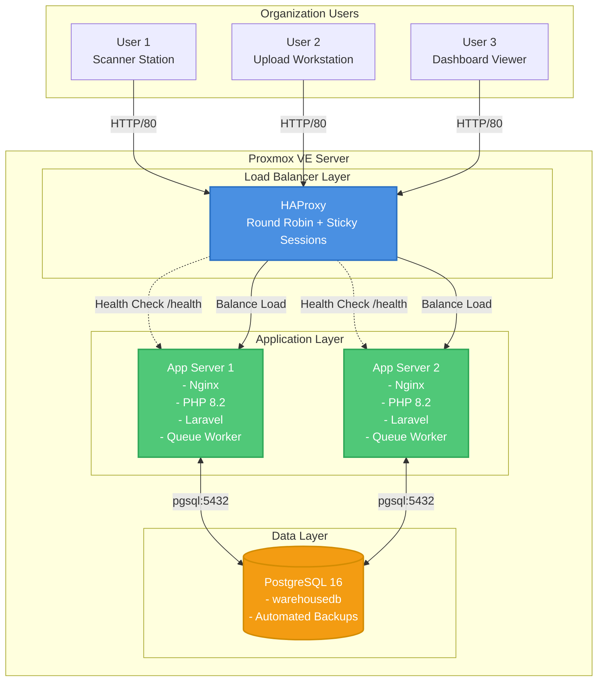
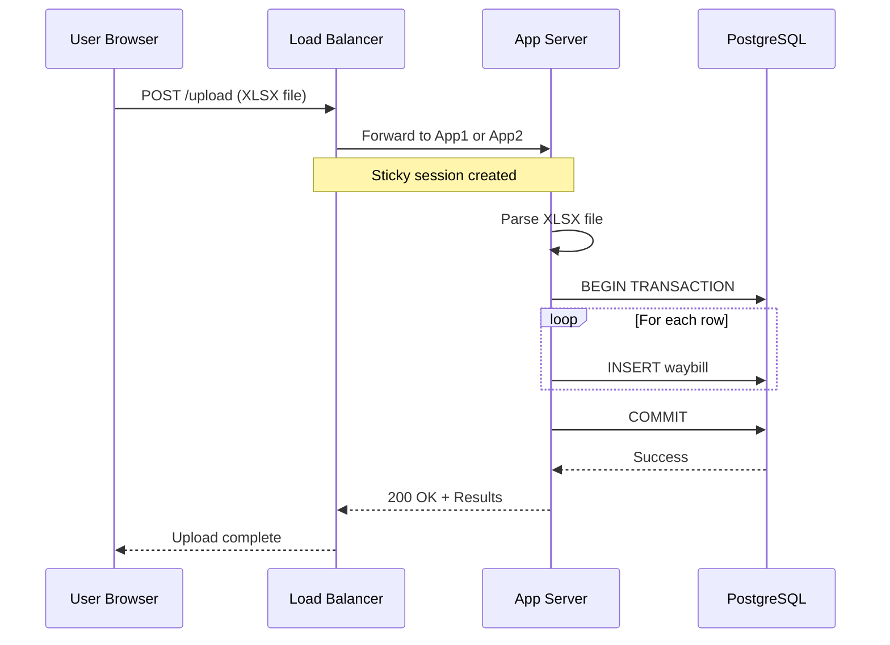
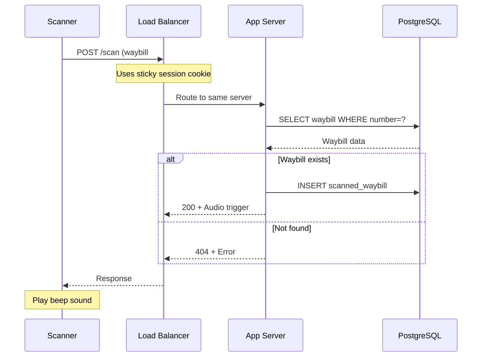
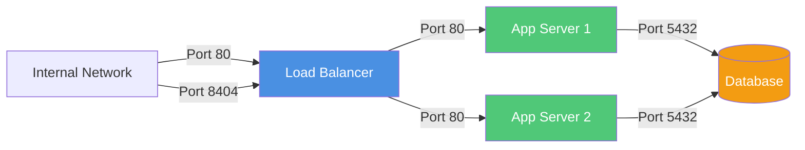

# System Architecture

Architecture documentation for the Proxmox-based Waybill Scanning System with load balancing.

## High-Level Architecture



## Component Details

### 1. Load Balancer (HAProxy)

**Purpose:** Distribute incoming requests across multiple application servers

**Specifications:**
- **Software:** HAProxy 2.8+
- **Algorithm:** Round Robin
- **Sticky Sessions:** Cookie-based (SERVERID)
- **Health Checks:** HTTP GET /health every 3 seconds
- **Ports:** 80 (HTTP), 8404 (Statistics)

**Features:**
- Automatic failover (if one server fails)
- Statistics dashboard for monitoring
- Request distribution tracking
- Session persistence for scanner functionality

**Configuration:** [`haproxy.cfg`](file:///home/it-admin/Documents/v4/v4/deployment/config/haproxy.cfg)

### 2. Application Servers (2x Identical)

**Purpose:** Run Laravel application and handle user requests

**Stack:**
- **Web Server:** Nginx 1.24
- **PHP:** 8.2-FPM (FastCGI Process Manager)
- **Framework:** Laravel 11
- **Queue Worker:** Systemd service for background jobs

**Key Features:**
- Health check endpoint (`/health`) for load balancer
- Session storage in database (for load balancing)
- Large file upload support (100MB for XLSX)
- PHP-FPM optimized for performance
- Queue workers for async processing

**Configuration:** [`nginx-site.conf`](file:///home/it-admin/Documents/v4/v4/deployment/config/nginx-site.conf)

### 3. Database Server (PostgreSQL)

**Purpose:** Centralized data storage for all application servers

**Specifications:**
- **RDBMS:** PostgreSQL 16
- **Database:** warehousedb
- **Authentication:** md5
- **Remote Access:** Enabled for app servers
- **Backups:** Daily at 2:00 AM, retained for 7 days

**Performance Tuning:**
- `shared_buffers = 2GB`
- `effective_cache_size = 6GB`
- `max_connections = 100`
- Optimized for warehouse operations

## Data Flow

### Upload Workflow



### Scanner Workflow



## Network Topology

### IP Addressing

| Component | Hostname | IP Address | Ports |
|-----------|----------|------------|-------|
| Load Balancer | waybill-lb | Configurable | 80, 8404, 22 |
| App Server 1 | waybill-app1 | Configurable | 80, 22 |
| App Server 2 | waybill-app2 | Configurable | 80, 22 |
| Database | waybill-db | Configurable | 5432, 22 |

### Firewall Rules



## Session Management

### Why Database Sessions?

In a load-balanced environment, **file-based sessions don't work** because:
- App Server 1's sessions are on its own filesystem
- App Server 2 can't read App Server 1's session files
- Users would lose session data between requests

**Solution:** Store sessions in the shared PostgreSQL database

**Configuration:**
```env
SESSION_DRIVER=database
CACHE_STORE=database
```

**Session Table:**
```sql
CREATE TABLE sessions (
    id VARCHAR(255) PRIMARY KEY,
    user_id BIGINT,
    ip_address VARCHAR(45),
    user_agent TEXT,
    payload TEXT,
    last_activity INTEGER
);
```

### Sticky Sessions

For the **scanner functionality**, we use sticky sessions because:
- Scanner may maintain WebSocket-like connections
- Audio feedback needs consistent server responses
- Better performance (no database lookups on every request)

**Implementation:** Cookie-based (SERVERID)
- First request: HAProxy sets `Set-Cookie: SERVERID=app1`
- Subsequent requests: Browser sends cookie, routed to same server
- If server fails: HAProxy routes to available server

## High Availability

### Failure Scenarios

| Scenario | Impact | Recovery |
|----------|--------|----------|
| App Server 1 fails | 50% capacity | HAProxy routes all to App Server 2, automatic |
| App Server 2 fails | 50% capacity | HAProxy routes all to App Server 1, automatic |
| Database fails | **Complete outage** | Manual restart required |
| Load Balancer fails | **Complete outage** | Manual restart required |

### Recommendations for Production

1. **Database Replication:** Set up PostgreSQL streaming replication
2. **LB Redundancy:** Use Keepalived + VRRP for HAProxy failover
3. **Monitoring:** Implement Prometheus + Grafana
4. **Backups:** Store off-VM (e.g., NAS, S3-compatible storage)

## Performance Characteristics

### Expected Capacity

Based on default configuration:

- **Concurrent Users:** ~100-150
- **Requests per Second:** ~200 (balanced across 2 servers)
- **Upload Processing:** ~5,000 rows/minute
- **Scanner Throughput:** ~60 scans/minute per server

### Bottlenecks

1. **Database:** Single point, handles all writes
2. **PHP-FPM Workers:** 20 workers per server = 40 total
3. **Network:** Internal LAN should be 1 Gbps minimum

### Optimization Opportunities

1. Add **Redis** for session/cache storage (faster than database)
2. Increase PHP-FPM workers if CPU allows
3. Add more application servers (scale horizontally)
4. Implement database connection pooling (PgBouncer)

## Maintenance Windows

### Zero-Downtime Deployments

The architecture supports zero-downtime deployments:

1. Put App Server 1 in maintenance
2. Deploy to App Server 1
3. Bring App Server 1 back online
4. Wait for health checks to pass
5. Put App Server 2 in maintenance
6. Deploy to App Server 2
7. Bring App Server 2 back online

During this process, at least one server is always available.

**Script:** [`deploy-app.sh`](file:///home/it-admin/Documents/v4/v4/deployment/scripts/deploy-app.sh)

### Scheduled Maintenance

Recommended schedule:

- **Daily:** Automated database backups (2:00 AM)
- **Weekly:** Review HAProxy stats, check disk space
- **Monthly:** Apply security updates, clear old logs
- **Quarterly:** Review and optimize database indexes

## Security Architecture

### Network Segmentation

```
Internal Network (192.168.x.x/24)
├── Load Balancer (exposed to users)
├── Application Servers (only accessible from LB)
└── Database (only accessible from app servers)
```

### Authentication & Authorization

- **No public access:** Internal organizational use only
- **No user authentication:** (Optional to implement)
- **Database:** Password-protected with md5 authentication
- **SSH:** Key-based authentication only

### Data Protection

- **In Transit:** HTTP (optional HTTPS with self-signed cert)
- **At Rest:** PostgreSQL database on encrypted VM disk (optional)
- **Backups:** Compressed SQL dumps, retained 7 days

## Monitoring & Observability

### Built-in Monitoring

1. **HAProxy Statistics:**
   - URL: `http://<LB_IP>:8404/stats`
   - Shows: Request counts, error rates, server status
   - Real-time updates every 10 seconds

2. **Application Logs:**
   - Laravel: `/var/www/waybill/storage/logs/laravel.log`
   - Nginx: `/var/log/nginx/waybill-error.log`
   - Queue Worker: `journalctl -u waybill-worker -f`

3. **Database:**
   - PostgreSQL logs: `/var/log/postgresql/`
   - Query performance: `pg_stat_statements` extension

### Health Checks

Each app server exposes `/health` endpoint:

```bash
curl http://<APP_IP>/health
# Response: healthy
```

HAProxy monitors this every 3 seconds:
- 3 consecutive failures → Mark server as DOWN
- 2 consecutive successes → Mark server as UP

## Disaster Recovery

### Backup Strategy

**Database Backups:**
- **Frequency:** Daily at 2:00 AM
- **Location:** `/var/backups/waybill/`
- **Retention:** 7 days
- **Format:** Compressed SQL dump

**VM Snapshots (Optional):**
```bash
# Create snapshot
qm snapshot <VMID> before-upgrade

# Restore snapshot
qm rollback <VMID> before-upgrade
```

### Recovery Procedures

**Database Corruption:**
```bash
# Restore from latest backup
ssh ubuntu@<DB_IP>
LATEST=$(ls -t /var/backups/waybill/*.sql.gz | head -1)
gunzip < $LATEST | psql -U devuser -d warehousedb
```

**Complete Infrastructure Loss:**
1. Run `vm-setup.sh` to recreate VMs
2. Run setup scripts on each VM
3. Restore database from backup
4. Deploy application code

**Recovery Time Objective (RTO):** ~2 hours  
**Recovery Point Objective (RPO):** 24 hours (last backup)

---

**Architecture Version:** 1.0  
**Date:** 2025-12-05  
**Maintainer:** IT Admin
