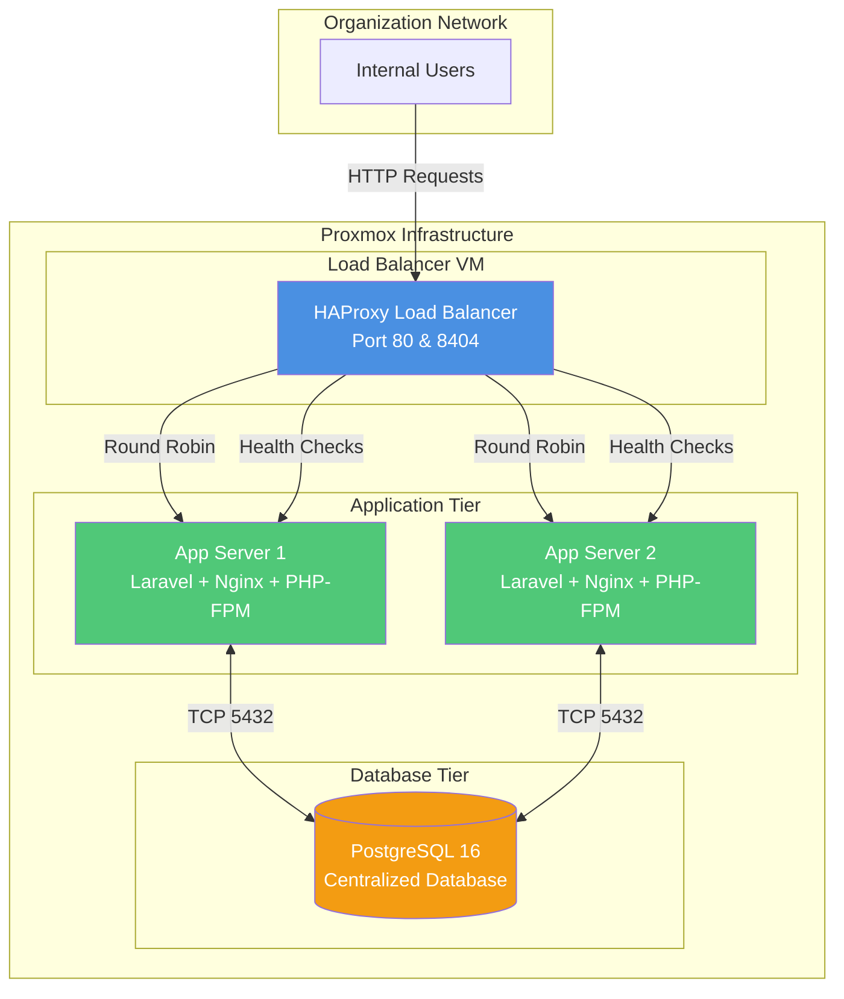

# Proxmox Deployment Guide

Complete guide for deploying the Laravel Waybill Scanning System on Proxmox with load balancing.

## Architecture Overview



## System Requirements

### Hardware Resources

| Component | vCPU | RAM | Storage | Count |
|-----------|------|-----|---------|-------|
| Database VM | 4 | 8 GB | 50 GB | 1 |
| App Server VM | 2 | 4 GB | 30 GB | 2 |
| Load Balancer VM | 2 | 2 GB | 20 GB | 1 |
| **Total** | **10** | **18 GB** | **130 GB** | **4** |

### Network Requirements

- 4 available static IP addresses
- Network bridge configured in Proxmox
- Gateway and DNS servers

## Pre-Deployment Setup

### 1. Configure Environment Variables

Edit [`config.env`](file:///home/it-admin/Documents/v4/v4/deployment/config.env) with your specific settings:

```bash
cd /home/it-admin/Documents/v4/v4/deployment
nano config.env
```

**Critical settings to update:**
- `DB_VM_IP`, `APP1_VM_IP`, `APP2_VM_IP`, `LB_VM_IP` - Your VM IP addresses
- `GATEWAY`, `NETMASK`, `DNS_SERVERS` - Your network configuration
- `PROXMOX_NODE`, `STORAGE_POOL`, `NETWORK_BRIDGE` - Your Proxmox settings
- `DB_PASSWORD` - Change to a strong password

### 2. Generate SSH Key (if needed)

```bash
ssh-keygen -t rsa -b 4096 -f ~/.ssh/id_rsa
```

### 3. Prepare Application Source

Ensure your Laravel application is ready at:
```
/home/it-admin/Documents/v4/v4/laravel
```

## Deployment Steps

### Step 1: Create VMs on Proxmox

> [!IMPORTANT]
> Run this on your **Proxmox host**, not on your local machine.

```bash
# Copy deployment files to Proxmox host
scp -r /home/it-admin/Documents/v4/v4/deployment root@<proxmox-host>:/tmp/

# SSH to Proxmox host
ssh root@<proxmox-host>

# Run VM setup script
cd /tmp/deployment
./scripts/vm-setup.sh
```

This will create 4 VMs with cloud-init configuration.

**Start the VMs:**
```bash
qm start 200  # Database
qm start 201  # App Server 1
qm start 202  # App Server 2
qm start 203  # Load Balancer
```

**Wait 2-3 minutes** for cloud-init to complete.

### Step 2: Verify VM Creation

```bash
./scripts/verify-vms.sh
```

This checks:
- ✓ VM status (running/stopped)
- ✓ Network connectivity (ping)
- ✓ SSH accessibility

### Step 3: Setup Database Server

```bash
# Copy configuration to database VM
scp config.env ubuntu@<DB_VM_IP>:/tmp/

# SSH to database VM
ssh ubuntu@<DB_VM_IP>

# Run database setup script
sudo bash /tmp/database-setup.sh
```

**What this does:**
- Installs PostgreSQL 16
- Creates database and user
- Configures remote access
- Sets up automated backups
- Optimizes performance

**Expected output:** Database connection string and backup configuration

### Step 4: Setup Application Servers

Repeat for **both** app servers (APP1 and APP2):

```bash
# Prepare application files
ssh ubuntu@<APP_VM_IP>
sudo mkdir -p /tmp/laravel

# From your local machine, copy Laravel app
scp -r /home/it-admin/Documents/v4/v4/laravel/* ubuntu@<APP_VM_IP>:/tmp/laravel/

# Copy configuration
scp deployment/config.env ubuntu@<APP_VM_IP>:/tmp/

# SSH to app server
ssh ubuntu@<APP_VM_IP>

# Run setup script
sudo bash /tmp/app-server-setup.sh
```

**What this does:**
- Installs PHP 8.2, Nginx, Composer
- Deploys Laravel application
- Configures database connection
- Sets up queue workers
- Creates health check endpoint

**Test each server:**
```bash
curl http://<APP_VM_IP>/health
# Should return: healthy
```

### Step 5: Setup Load Balancer

```bash
# Copy HAProxy config
scp deployment/config/haproxy.cfg ubuntu@<LB_VM_IP>:/tmp/
scp deployment/config.env ubuntu@<LB_VM_IP>:/tmp/

# SSH to load balancer
ssh ubuntu@<LB_VM_IP>

# Run setup script
sudo bash /tmp/loadbalancer-setup.sh
```

**What this does:**
- Installs HAProxy
- Configures round-robin load balancing
- Sets up sticky sessions (cookie-based)
- Enables health checks
- Configures statistics dashboard

## Post-Deployment Verification

### 1. Test Load Balancer

From your local machine:

```bash
cd /home/it-admin/Documents/v4/v4/deployment
./scripts/test-load-balancer.sh <LB_VM_IP>
```

This runs 5 tests:
1. ✓ Basic connectivity
2. ✓ Health check endpoint
3. ✓ Load distribution (100 requests)
4. ✓ Sticky sessions
5. ✓ Statistics dashboard

### 2. Access the Application

Open your browser:
- **Application**: `http://<LB_VM_IP>/`
- **Statistics Dashboard**: `http://<LB_VM_IP>:8404/stats`
  - Username: `admin`
  - Password: `admin123`

### 3. Manual Testing Checklist

- [ ] Dashboard loads with statistics
- [ ] Upload XLSX file successfully
- [ ] Scan waybill with barcode scanner
- [ ] Search and filter waybills
- [ ] Check both app servers in stats dashboard (both should be green/UP)
- [ ] Verify request distribution is balanced

## Daily Operations

### Deploying Application Updates

```bash
cd /home/it-admin/Documents/v4/v4/deployment
./scripts/deploy-app.sh
```

This performs zero-downtime deployment:
1. Puts app in maintenance mode
2. Updates code via rsync
3. Runs migrations
4. Clears cache
5. Restarts services
6. Brings app back online

### Monitoring

**Check HAProxy Statistics:**
```
http://<LB_VM_IP>:8404/stats
```

**Check individual services:**
```bash
# On app servers
sudo systemctl status nginx
sudo systemctl status php8.2-fpm
sudo systemctl status waybill-worker

# On database server
sudo systemctl status postgresql

# On load balancer
sudo systemctl status haproxy
```

**View logs:**
```bash
# Application logs
ssh ubuntu@<APP_VM_IP>
tail -f /var/www/waybill/storage/logs/laravel.log

# Nginx logs
tail -f /var/log/nginx/waybill-error.log

# HAProxy logs
ssh ubuntu@<LB_VM_IP>
tail -f /var/log/haproxy.log
```

### Database Backups

Backups run automatically daily at 2:00 AM.

**Manual backup:**
```bash
ssh ubuntu@<DB_VM_IP>
sudo /usr/local/bin/backup-waybill-db.sh
```

**Restore from backup:**
```bash
ssh ubuntu@<DB_VM_IP>
gunzip < /var/backups/waybill/waybill_TIMESTAMP.sql.gz | psql -U devuser -d warehousedb
```

## Troubleshooting

### Load Balancer Not Distributing Traffic

**Check HAProxy status:**
```bash
ssh ubuntu@<LB_VM_IP>
sudo systemctl status haproxy
sudo haproxy -c -f /etc/haproxy/haproxy.cfg
```

**Check backend servers in stats:**
- Visit `http://<LB_VM_IP>:8404/stats`
- Look for red/down servers
- Check "Status" column

### Application Server Not Responding

**Check health endpoint:**
```bash
curl http://<APP_VM_IP>/health
```

**Check Nginx:**
```bash
ssh ubuntu@<APP_VM_IP>
sudo systemctl status nginx
sudo nginx -t
```

**Check PHP-FPM:**
```bash
sudo systemctl status php8.2-fpm
tail -f /var/log/php8.2-fpm.log
```

### Database Connection Issues

**Test from app server:**
```bash
ssh ubuntu@<APP_VM_IP>
cd /var/www/waybill
php artisan db:show
```

**Check PostgreSQL:**
```bash
ssh ubuntu@<DB_VM_IP>
sudo systemctl status postgresql
sudo -u postgres psql -c "SELECT version();"
```

**Check pg_hba.conf allows connections:**
```bash
sudo cat /etc/postgresql/*/main/pg_hba.conf | grep -v "^#"
```

### Sticky Sessions Not Working

**Check cookie in browser:**
- Open Developer Tools → Network
- Look for `Set-Cookie: SERVERID=app1` or `app2`
- Cookie should persist across requests

**Check HAProxy config:**
```bash
ssh ubuntu@<LB_VM_IP>
sudo grep -A5 "backend waybill_backend" /etc/haproxy/haproxy.cfg
# Should see: cookie SERVERID insert indirect nocache
```

## Scaling Considerations

### Adding More Application Servers

1. Create new VM using same process
2. Install application using `app-server-setup.sh`
3. Add to HAProxy backend:
```bash
# Edit /etc/haproxy/haproxy.cfg
server app3 <APP3_IP>:80 check cookie app3 inter 3s fall 3 rise 2
```
4. Reload HAProxy: `sudo systemctl reload haproxy`

### Upgrading Resources

```bash
# Shutdown VM
qm shutdown <VMID>

# Increase CPU
qm set <VMID> -cores 4

# Increase RAM
qm set <VMID> -memory 8192

# Increase disk
qm resize <VMID> scsi0 +20G

# Start VM
qm start <VMID>
```

## Security Best Practices

### Change Default Passwords

**HAProxy stats:**
```bash
# Edit /etc/haproxy/haproxy.cfg
stats auth admin:YOUR_SECURE_PASSWORD
```

**Database:**
```bash
sudo -u postgres psql
ALTER USER devuser WITH PASSWORD 'new_secure_password';
```

Update `.env` on all app servers accordingly.

### Firewall Configuration (Optional)

```bash
# On each VM
sudo ufw allow 22/tcp  # SSH
sudo ufw enable

# Database VM
sudo ufw allow from <APP1_IP> to any port 5432
sudo ufw allow from <APP2_IP> to any port 5432

# App servers
sudo ufw allow from <LB_IP> to any port 80

# Load balancer
sudo ufw allow 80/tcp
sudo ufw allow 8404/tcp
```

### SSL/TLS (Optional for Internal)

If you want HTTPS:

1. Generate self-signed certificate:
```bash
ssh ubuntu@<LB_VM_IP>
sudo openssl req -x509 -nodes -days 365 -newkey rsa:2048 \
  -keyout /etc/ssl/private/waybill.key \
  -out /etc/ssl/certs/waybill.crt
```

2. Update HAProxy config:
```
frontend waybill_frontend
    bind *:443 ssl crt /etc/ssl/certs/waybill.pem
    # Redirect HTTP to HTTPS
    bind *:80
    redirect scheme https if !{ ssl_fc }
```

3. Combine cert and key:
```bash
cat /etc/ssl/certs/waybill.crt /etc/ssl/private/waybill.key > /etc/ssl/certs/waybill.pem
```

## File Reference

### Configuration Files
- [config.env](file:///home/it-admin/Documents/v4/v4/deployment/config.env) - Main configuration
- [haproxy.cfg](file:///home/it-admin/Documents/v4/v4/deployment/config/haproxy.cfg) - HAProxy template
- [nginx-site.conf](file:///home/it-admin/Documents/v4/v4/deployment/config/nginx-site.conf) - Nginx template

### Setup Scripts
- [vm-setup.sh](file:///home/it-admin/Documents/v4/v4/deployment/scripts/vm-setup.sh) - Create VMs on Proxmox
- [database-setup.sh](file:///home/it-admin/Documents/v4/v4/deployment/scripts/database-setup.sh) - Setup PostgreSQL
- [app-server-setup.sh](file:///home/it-admin/Documents/v4/v4/deployment/scripts/app-server-setup.sh) - Setup Laravel app
- [loadbalancer-setup.sh](file:///home/it-admin/Documents/v4/v4/deployment/scripts/loadbalancer-setup.sh) - Setup HAProxy

### Utility Scripts
- [deploy-app.sh](file:///home/it-admin/Documents/v4/v4/deployment/scripts/deploy-app.sh) - Deploy updates
- [test-load-balancer.sh](file:///home/it-admin/Documents/v4/v4/deployment/scripts/test-load-balancer.sh) - Test load balancing
- [verify-vms.sh](file:///home/it-admin/Documents/v4/v4/deployment/scripts/verify-vms.sh) - Verify VM status

## Support

For issues or questions:
1. Check this documentation
2. Review logs on relevant VMs
3. Check HAProxy statistics dashboard
4. Contact your system administrator

---

**Deployment Version:** 1.0  
**Last Updated:** 2025-12-05  
**Target Platform:** Proxmox VE with Ubuntu 24.04 LTS
